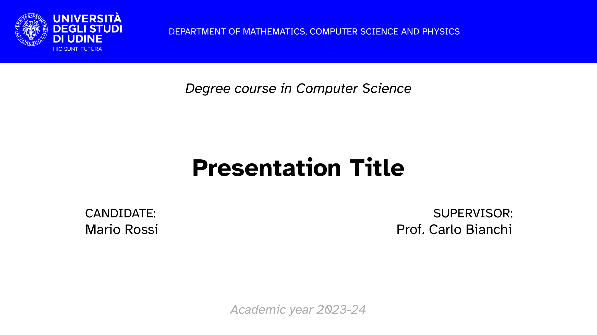

<!-- ToC hint -->

Table of Contents ↗️

<!-- Header -->
 

    
    <h1 align="center">UniUD Slides</h1>
    

        
        
         
        An unofficial <a href="https://typst.app">Typst</a> template for presentation slides at the <a href="https://www.uniud.it/it">University of Udine</a>.
         
    

<!-- Cover image -->

    

<!-- Readme contents -->

## Usage Instructions

In order to use this template:
1. install [Typst](https://typst.app) on your computer;
2. fork this repository;
3. clone your fork locally;
4. edit `./src/main.typ` and `./src/bibliography.yaml`;
5. run `typst compile ./src/main.typ`;
6. enjoy your slides!

Alternatively, you can also upload all the files contained in the `./src` folder to the online Typst editor.
