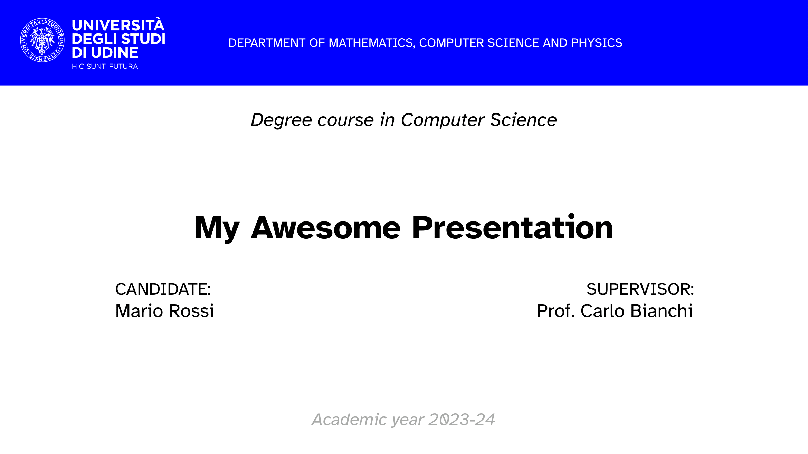
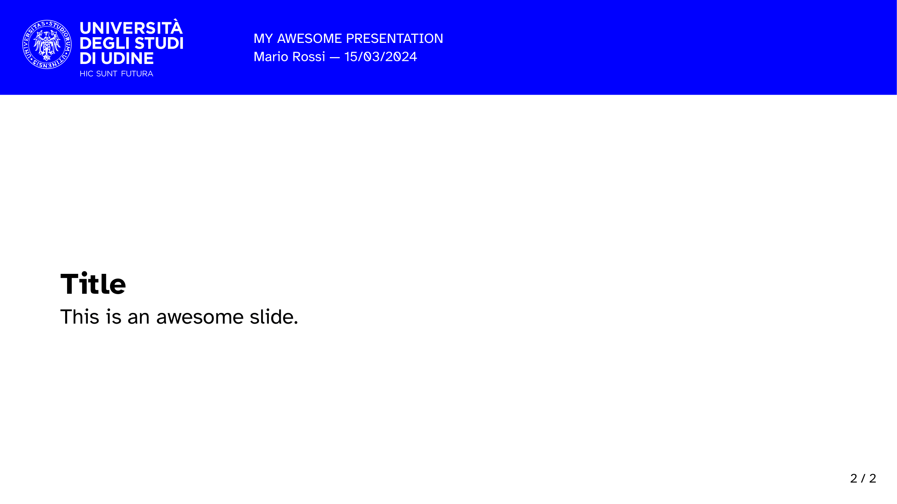

<!-- ToC hint -->

Table of Contents ↗️

<!-- Header -->
 

    
    <h1 align="center">UniUD Slides</h1>
    

        
        
         
        An unofficial <a href="https://typst.app">Typst</a> template for presentation slides at the <a href="https://www.uniud.it/it">University of Udine</a>.
         
    

<!-- Readme contents -->

## Preview

|  |  |
| -------------------------------------------------------- | ---------------------------------------------------------- |
| Title slide                                              | Content slide                                              |

## Usage Instructions

### Local installation

If you wish to use a local installation of the Typst compiler on your computer, follow these instructions to use this template:
1. fork this repository;
2. clone your fork on your machine;
3. run `typst watch ./src/main.typ --font-path ./src/uniud-slides/assets/fonts`;
4. edit `./src/main.typ` and `./src/bibliography.yaml` to create your presentation;
5. (optional) use git with your fork for version control;
6. enjoy your slides!

### Web editor

If you prefer to use the Typst webapp, follow these instructions instead:
1. download a copy of this repository;
2. upload all the contents of the `./src` folder to the web editor;
3. edit `./src/main.typ` and `./src/bibliography.yaml` to create your presentation;
4. enjoy your slides!
